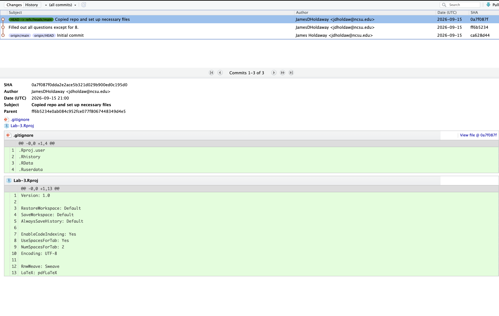

## Question 1

"Already up to date" because there is nothing new in the repo to pull. The only new files and file updates are on my device currently.

## Question 2

install.packages() should be ran in the console because it is downloading the package to your device.

## Question 3
library() should go in the .qmd file because it loads the package for use wiht our code. 

## Question 4
No, palmerpenguins::penguins does not work initially because the package has not been installed yet. 

```{r}
library(palmerpenguins)

palmerpenguins::penguins
```

## Question 5
```{r}
palmerpenguins::penguins
```
You need to library it beforehand or R will return something along the lines of "penguin" object not recognized. 

## Question 6
We can hide warning messages by using the warning chunk option and setting it to false. 

## Question 7
You can access the help file for the arrange function (dplyr) by entering ?arrange into the console. This function orders the rows of a data frame by the values of selected columns. 

## Question 8 


